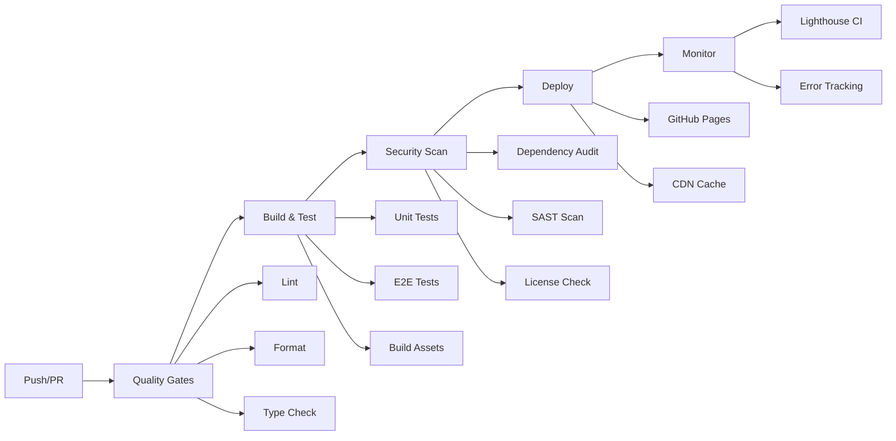

# Tech.ish Thoughts

> A modern, performant multi-author tech blog with advanced search capabilities, text-to-speech features, and interactive components.

[](https://github.com/techishthoughts/techishthoughts.github.io/actions)
[](https://opensource.org/licenses/MIT)
[](https://www.typescriptlang.org/)
[](https://gohugo.io/)
[](https://reactjs.org/)

## 🚀 Live Demo

Visit [techishthoughts.github.io](https://techishthoughts.github.io) to see the blog in action.

## 📋 Table of Contents

- [Tech Stack](#tech-stack)
- [Architecture](#architecture)
- [Features](#features)
- [Getting Started](#getting-started)
- [Development Guide](#development-guide)
- [Pre-Commit Setup](#pre-commit-setup)
- [Design & Accessibility](#design--accessibility)
- [Writing Articles](#writing-articles)
- [Contributing](#contributing)
- [Deployment](#deployment)
- [Performance](#performance)
- [Testing](#testing)

## 🛠 Tech Stack

### Core Technologies

- **[Hugo](https://gohugo.io/)** `v0.147.5+` - Static site generator chosen for:

  - ⚡ **Performance**: Sub-second build times for 100+ posts
  - 🔍 **SEO Excellence**: Built-in SEO optimization and structured data
  - 📱 **Mobile-First**: Responsive templates out of the box
  - 🌐 **Multi-language**: Ready for internationalization

- **[React](https://reactjs.org/)** `v18.2.0` - Interactive UI components for:

  - 🎯 **Component Reusability**: Modular, testable components
  - 🔄 **State Management**: Complex interactions (search, comments, TTS)
  - 🎨 **Dynamic UI**: Real-time updates and animations
  - ♿ **Accessibility**: ARIA support and keyboard navigation

- **[TypeScript](https://www.typescriptlang.org/)** `v5.3.3` - Type safety providing:

  - 🛡️ **Runtime Safety**: Catch errors at compile time
  - 📖 **Developer Experience**: IntelliSense and auto-completion
  - 🔧 **Refactoring**: Safe code changes across large codebase
  - 📚 **Documentation**: Self-documenting code through types

- **[Vite](https://vitejs.dev/)** `v6.3.5` - Modern build tool offering:
  - ⚡ **Fast HMR**: Instant hot module replacement
  - 📦 **Optimized Builds**: Tree-shaking and code splitting
  - 🔌 **Plugin Ecosystem**: Rich plugin architecture
  - 🎯 **Development Speed**: Sub-second cold starts

### Frontend Stack

- **[Chakra UI](https://chakra-ui.com/)** `v2.8.2` - Design system providing:

  - 🎨 **Consistent Design**: Unified component library
  - 🌙 **Dark Mode**: Built-in theme switching
  - ♿ **Accessibility**: WCAG 2.1 AA compliant components
  - 📱 **Responsive**: Mobile-first responsive design
  - 🎭 **Customization**: Extensive theming capabilities

- **[Framer Motion](https://www.framer.com/motion/)** `v10.18.0` - Animation library for:

  - ✨ **Smooth Animations**: 60fps performance animations
  - 🎯 **Gesture Handling**: Touch and mouse interactions
  - 📐 **Layout Animations**: Automatic layout transitions
  - 🎪 **Complex Sequences**: Orchestrated animation timelines

- **[TanStack Query](https://tanstack.com/query/latest)** `v5.17.15` - Server state management:

  - 🔄 **Caching**: Intelligent data caching and invalidation
  - 🔁 **Background Updates**: Automatic refetching
  - ⚡ **Optimistic Updates**: Instant UI feedback
  - 📡 **Offline Support**: Offline-first architecture

- **[Zustand](https://github.com/pmndrs/zustand)** `v4.4.7` - Lightweight state management:

  - 🪶 **Minimal Bundle**: <1KB compressed
  - 🎯 **Simple API**: No boilerplate required
  - 🔄 **Persistence**: LocalStorage integration
  - 🧪 **Testing**: Easy to mock and test

- **[Fuse.js](https://fusejs.io/)** `v7.0.0` - Fuzzy search implementation:
  - 🔍 **Intelligent Search**: Typo-tolerant search
  - ⚡ **Fast Performance**: Optimized for large datasets
  - 🎯 **Relevance Scoring**: Weighted search results
  - 🔧 **Configurable**: Customizable search algorithms

### Development Tools

- **[Vitest](https://vitest.dev/)** `v3.2.4` - Testing framework chosen for:

  - ⚡ **Speed**: 10x faster than Jest
  - 🔧 **Vite Integration**: Native Vite support
  - 🎯 **Modern Features**: ESM, TypeScript, JSX out of the box
  - 📊 **Coverage**: Built-in code coverage with v8

- **[Playwright](https://playwright.dev/)** `v1.53.1` - E2E testing providing:

  - 🌐 **Cross-Browser**: Chrome, Firefox, Safari, Edge
  - 📱 **Mobile Testing**: Real device simulation
  - 🎥 **Test Recording**: Video and screenshot capture
  - 🔄 **Auto-Wait**: Smart waiting for elements

- **[ESLint](https://eslint.org/)** `v8.57.1` - Code linting with:

  - 🛡️ **Error Prevention**: Catch bugs before runtime
  - 📏 **Code Standards**: Consistent code style
  - 🔧 **Auto-Fix**: Automatic code corrections
  - 🎯 **TypeScript Support**: Full TS integration

- **[Prettier](https://prettier.io/)** `v3.2.4` - Code formatting ensuring:

  - 🎨 **Consistent Style**: Unified code formatting
  - ⚡ **Fast Formatting**: Instant code beautification
  - 🔧 **Zero Config**: Works out of the box
  - 🤝 **Team Consistency**: No more style debates

- **[Husky](https://github.com/typicode/husky)** `v8.0.3` - Git hooks for:
  - 🛡️ **Quality Gates**: Pre-commit validation
  - 📏 **Commit Standards**: Conventional commit enforcement
  - 🧪 **Test Automation**: Run tests before commits
  - 🔒 **Security**: Prevent bad code from entering repo

### CI/CD & Deployment

- **GitHub Actions** - Automated workflows providing:

  - 🔄 **Continuous Integration**: Automated testing on every PR
  - 🚀 **Continuous Deployment**: Automatic deployment to GitHub Pages
  - 🔒 **Security Scanning**: Automated vulnerability detection
  - 📊 **Performance Monitoring**: Lighthouse CI integration
  - 🤖 **Dependency Management**: Automated dependency updates

- **GitHub Pages** - Static hosting offering:

  - 🌐 **Global CDN**: Fast content delivery worldwide
  - 🔒 **HTTPS**: Automatic SSL certificate management
  - 🎯 **Custom Domain**: Custom domain support
  - 📈 **Analytics**: Built-in traffic analytics

- **Dependabot** - Dependency management providing:
  - 🔄 **Auto Updates**: Automated dependency updates
  - 🛡️ **Security Alerts**: Vulnerability notifications
  - 📊 **Compatibility Checks**: Automated testing of updates
  - 🎯 **Smart Scheduling**: Configurable update frequency

## 📦 Dependency Architecture & Rationale

### Core Dependencies Philosophy

Our dependency selection follows these principles:

- **🎯 Purpose-Driven**: Each dependency solves a specific problem
- **📏 Bundle Size**: Minimize impact on user experience
- **🔒 Security**: Regular updates and vulnerability monitoring
- **🧪 Testability**: Dependencies that enhance testing capabilities
- **📈 Maintenance**: Active community and long-term support

### Production Dependencies

#### **Content Management & Generation**

```json
{
  "hugo-bin": "^0.147.5"
}
```

**Why Hugo?**

- ⚡ **Performance**: 10-100x faster than traditional CMSs
- 🔍 **SEO-First**: Built-in SEO optimization
- 📱 **Mobile-Ready**: Responsive by default
- 🌐 **CDN-Friendly**: Static files perfect for global distribution
- 🔧 **Flexible**: Extensive templating and customization

#### **React Ecosystem**

```json
{
  "react": "^18.2.0",
  "react-dom": "^18.2.0"
}
```

**Why React 18?**

- 🔄 **Concurrent Features**: Better user experience with Suspense
- 🎯 **Component Model**: Reusable, testable components
- 🌟 **Ecosystem**: Vast library ecosystem
- 📈 **Performance**: Automatic batching and optimizations
- 🧪 **Testing**: Excellent testing library support

#### **UI Framework**

```json
{
  "@chakra-ui/react": "^2.8.2",
  "@chakra-ui/icons": "^2.1.1",
  "@emotion/react": "^11.11.1",
  "@emotion/styled": "^11.11.0"
}
```

**Why Chakra UI?**

- ♿ **Accessibility**: WCAG 2.1 AA compliant out of the box
- 🎨 **Design System**: Consistent, professional design
- 🌙 **Dark Mode**: Built-in theme switching
- 📱 **Responsive**: Mobile-first approach
- 🔧 **Customizable**: Extensive theming capabilities
- 📦 **Tree-Shakable**: Only bundle what you use

**Alternative Considered**: Material-UI (too heavy), Tailwind (less accessible)

#### **State Management**

```json
{
  "zustand": "^4.4.7",
  "@tanstack/react-query": "^5.17.15"
}
```

**Why Zustand?**

- 🪶 **Lightweight**: <1KB vs Redux's ~20KB
- 🎯 **Simple API**: No boilerplate, easy to understand
- 🔄 **Persistence**: Built-in localStorage integration
- 🧪 **Testable**: Easy to mock and test
- 📈 **Performance**: Minimal re-renders

**Why TanStack Query?**

- 🔄 **Caching**: Intelligent data caching and invalidation
- 📡 **Background Updates**: Automatic refetching
- ⚡ **Optimistic Updates**: Instant UI feedback
- 🔌 **Offline Support**: Works without internet
- 🧪 **DevTools**: Excellent debugging experience

**Alternatives Considered**: Redux (too complex), Context API (performance issues)

#### **Search & Data Processing**

```json
{
  "fuse.js": "^7.0.0"
}
```

**Why Fuse.js?**

- 🔍 **Fuzzy Search**: Typo-tolerant search
- ⚡ **Performance**: Optimized for large datasets
- 🎯 **Relevance**: Weighted search results
- 🔧 **Configurable**: Customizable search algorithms
- 📦 **Lightweight**: ~12KB minified

**Alternatives Considered**: Lunr.js (larger), Algolia (external dependency)

#### **Animation & Interactions**

```json
{
  "framer-motion": "^10.18.0"
}
```

**Why Framer Motion?**

- ✨ **Smooth Animations**: 60fps performance
- 🎯 **Gesture Handling**: Touch and mouse interactions
- 📐 **Layout Animations**: Automatic layout transitions
- 🎪 **Complex Sequences**: Orchestrated animations
- 🧪 **Testing**: Animation testing utilities

**Alternatives Considered**: React Spring (steeper learning curve), CSS animations (limited)

### Development Dependencies

#### **Build Tools**

```json
{
  "vite": "^6.3.5",
  "@vitejs/plugin-react": "^4.2.1"
}
```

**Why Vite?**

- ⚡ **Fast HMR**: Instant hot module replacement
- 📦 **Optimized Builds**: Tree-shaking and code splitting
- 🔌 **Plugin Ecosystem**: Rich plugin architecture
- 🎯 **Modern**: Native ESM support
- 🧪 **Testing**: Built-in testing integration

**Alternatives Considered**: Webpack (slower), Parcel (less mature)

#### **Testing Framework**

```json
{
  "vitest": "^3.2.4",
  "@testing-library/react": "^14.1.2",
  "@testing-library/jest-dom": "^6.1.5",
  "@testing-library/user-event": "^14.5.1",
  "playwright": "^1.53.1"
}
```

**Why Vitest?**

- ⚡ **Speed**: 10x faster than Jest
- 🔧 **Vite Integration**: Native Vite support
- 🎯 **Modern**: ESM, TypeScript, JSX out of the box
- 📊 **Coverage**: Built-in code coverage

**Why Testing Library?**

- 🎯 **User-Centric**: Test behavior, not implementation
- ♿ **Accessibility**: Encourages accessible design
- 🔍 **Semantic**: Query by role, label, text
- 🧪 **Best Practices**: Promotes good testing habits

**Why Playwright?**

- 🌐 **Cross-Browser**: Chrome, Firefox, Safari, Edge
- 📱 **Mobile**: Real device simulation
- 🎥 **Recording**: Video and screenshot capture
- 🔄 **Reliable**: Auto-wait and retry mechanisms

#### **Code Quality**

```json
{
  "typescript": "^5.3.3",
  "eslint": "^8.57.1",
  "prettier": "^3.2.4",
  "@typescript-eslint/eslint-plugin": "^6.16.0",
  "@typescript-eslint/parser": "^6.16.0"
}
```

**Why TypeScript?**

- 🛡️ **Type Safety**: Catch errors at compile time
- 📖 **Developer Experience**: IntelliSense and auto-completion
- 🔧 **Refactoring**: Safe code changes
- 📚 **Documentation**: Self-documenting code

**Why ESLint + Prettier?**

- 🛡️ **Error Prevention**: Catch bugs before runtime
- 📏 **Consistency**: Unified code style
- 🔧 **Auto-Fix**: Automatic corrections
- 🤝 **Team Harmony**: No style debates

#### **Git Hooks & Automation**

```json
{
  "husky": "^8.0.3",
  "lint-staged": "^15.2.0",
  "commitlint": "^18.4.3"
}
```

**Why Husky?**

- 🛡️ **Quality Gates**: Pre-commit validation
- 📏 **Standards**: Enforce commit conventions
- 🧪 **Automation**: Run tests before commits
- 🔒 **Prevention**: Stop bad code from entering repo

### Dependency Management Strategy

#### **Version Pinning Strategy**

```json
{
  "exact": ["react", "react-dom", "typescript"],
  "caret": ["@chakra-ui/*", "framer-motion"],
  "tilde": ["@types/*", "eslint-*"]
}
```

#### **Update Schedule**

- **Major Updates**: Quarterly review and testing
- **Minor Updates**: Monthly automated updates
- **Patch Updates**: Weekly automated updates
- **Security Updates**: Immediate (Dependabot alerts)

#### **Bundle Analysis**

```bash
# Regular bundle analysis
npm run analyze-bundle

# Size limits enforced
"bundlewatch": {
  "files": [
    {
      "path": "dist/assets/index-*.js",
      "maxSize": "300KB"
    }
  ]
}
```

#### **Security Monitoring**

- **Dependabot**: Automated security updates
- **npm audit**: Regular vulnerability scanning
- **Snyk**: Advanced vulnerability monitoring
- **License Compliance**: Automated license checking

### Performance Impact Analysis

| Category             | Dependencies         | Bundle Impact | Justification           |
| -------------------- | -------------------- | ------------- | ----------------------- |
| **Core React**       | react, react-dom     | 42KB          | Essential framework     |
| **UI Framework**     | @chakra-ui/\*        | 85KB          | Accessibility + DX      |
| **State Management** | zustand, react-query | 25KB          | Performance + UX        |
| **Search**           | fuse.js              | 12KB          | Core feature            |
| **Animation**        | framer-motion        | 32KB          | Enhanced UX             |
| **Total Runtime**    | -                    | **196KB**     | Well under 300KB budget |

### Alternatives Evaluation Matrix

| Need                 | Chosen    | Alternative 1 | Alternative 2 | Decision Rationale                   |
| -------------------- | --------- | ------------- | ------------- | ------------------------------------ |
| **UI Framework**     | Chakra UI | Material-UI   | Tailwind CSS  | Better accessibility, smaller bundle |
| **State Management** | Zustand   | Redux Toolkit | Context API   | Simplicity + performance             |
| **Testing**          | Vitest    | Jest          | Cypress       | Speed + Vite integration             |
| **Build Tool**       | Vite      | Webpack       | Parcel        | Modern + fast development            |
| **Search**           | Fuse.js   | Lunr.js       | Algolia       | Offline + lightweight                |

## 🏗 Architecture

### System Overview

```
┌─────────────────┐    ┌─────────────────┐    ┌─────────────────┐
│   Hugo (SSG)    │    │  React (SPA)    │    │  GitHub Pages   │
│                 │    │                 │    │                 │
│ • Content Gen   │    │ • Interactive   │    │ • Static Host   │
│ • Templates     │────│   Components    │────│ • CDN           │
│ • Static Files  │    │ • Search        │    │ • SSL           │
│ • SEO           │    │ • Comments      │    │ • Custom Domain │
└─────────────────┘    └─────────────────┘    └─────────────────┘
```

### Project Structure

```
techishthoughts.github.io/
├── assets/js/                 # React components and logic
│   ├── components/
│   │   ├── features/         # Feature components
│   │   │   ├── CommentsSection.tsx
│   │   │   ├── SocialActions.tsx
│   │   │   └── TagManager.tsx
│   │   ├── ui/              # Reusable UI components
│   │   └── layout/          # Layout components
│   ├── hooks/               # Custom React hooks
│   ├── stores/              # Zustand state stores
│   ├── services/            # API services
│   ├── types/               # TypeScript definitions
│   └── utils/               # Utility functions
├── content/                 # Hugo content
│   └── posts/              # Blog posts (Markdown)
├── layouts/                # Hugo templates
├── static/                 # Static assets
├── data/                   # Site data (authors, etc.)
└── .github/workflows/      # CI/CD pipelines
```

### Component Architecture

```
App (Hugo Template)
├── Header
│   ├── Navigation
│   └── Search Bar (React)
├── Main Content
│   ├── Article Content (Hugo)
│   ├── Text-to-Speech (React)
│   ├── Social Actions (React)
│   └── Comments Section (React)
└── Footer
    └── Social Links (React)
```

## ✨ Features

### 🔍 Advanced Search

- **Fuzzy Search**: Powered by Fuse.js for intelligent matching
- **Real-time Results**: Instant search-as-you-type
- **Content Indexing**: Searches through titles, content, tags, and authors
- **Keyboard Navigation**: Arrow keys and Enter for navigation

### 👥 Multi-Author Support

- **Author Profiles**: Rich author information with avatars
- **Author Pages**: Dedicated pages for each contributor
- **Social Links**: GitHub, Twitter, LinkedIn integration
- **Author Validation**: Automated validation of author data

### 🎧 Text-to-Speech

- **Article Narration**: Listen to articles with natural voice
- **Playback Controls**: Play, pause, speed adjustment
- **Voice Selection**: Multiple voice options
- **Mobile Optimized**: Works across all devices

### 💬 Comments System

- **Local Storage**: Comments persist locally
- **Like System**: Upvote/downvote functionality
- **Responsive Design**: Mobile-first approach
- **Moderation**: Built-in moderation capabilities

### 🏷 Dynamic Tagging

- **Tag Management**: Add, edit, delete tags
- **Tag Filtering**: Filter content by tags
- **Tag Validation**: Prevent duplicate tags
- **Tag Analytics**: Track tag usage

### 📱 Responsive Design

- **Mobile-First**: Optimized for mobile devices
- **Touch-Friendly**: Large touch targets
- **Fast Loading**: Optimized images and assets
- **Accessibility**: WCAG 2.1 compliant

### 🚀 Performance

- **Static Generation**: Pre-built HTML for speed
- **Code Splitting**: Lazy-loaded components
- **Image Optimization**: WebP format with fallbacks
- **Caching**: Aggressive caching strategies

## 🚀 Getting Started

### Prerequisites

- **Node.js**: >= 18.0.0
- **npm**: >= 9.0.0
- **Hugo**: >= 0.147.0
- **Git**: For version control

### Installation

1. **Clone the repository**

   ```bash
   git clone https://github.com/techishthoughts/techishthoughts.github.io.git
   cd techishthoughts.github.io
   ```

2. **Install dependencies**

   ```bash
   npm install
   ```

3. **Start development servers**

   ```bash
   # Terminal 1: Hugo development server
   npm run hugo:dev

   # Terminal 2: Vite development server (for React components)
   npm run dev
   ```

4. **Open in browser**
   - Hugo site: http://localhost:1313
   - Vite dev server: http://localhost:5173

### Development Workflow

```bash
# Start both servers in watch mode
npm run hugo:dev    # Hugo server with live reload
npm run watch       # Vite build in watch mode

# Run tests
npm run test        # Unit tests
npm run test:e2e    # End-to-end tests

# Code quality (with automatic formatting)
npm run lint        # ESLint
npm run format      # Auto-format all files
npm run format:check # Check formatting without fixing
npm run type-check  # TypeScript

# Pre-commit testing
npm run pre-commit:format  # Test format auto-fix
npm run pre-commit         # Full pre-commit flow
```

## 🖥 Development Guide

### Code Style

- **TypeScript**: Strict mode enabled
- **ESLint**: Airbnb configuration with React rules
- **Prettier**: Consistent code formatting
- **Import Order**: Absolute imports preferred

### State Management

- **Zustand**: For global state (comments, search, etc.)
- **React Query**: For server state and caching
- **Local Storage**: For persistence

### Component Guidelines

```typescript
// Example component structure
import React from 'react';
import { Box, Button } from '@chakra-ui/react';

interface Props {
  title: string;
  onClick: () => void;
}

export const MyComponent: React.FC<Props> = ({ title, onClick }) => {
  return (
    <Box>
      <Button onClick={onClick}>
        {title}
      </Button>
    </Box>
  );
};
```

### Testing Strategy

- **Unit Tests**: Test individual components and functions
- **Integration Tests**: Test component interactions
- **E2E Tests**: Test complete user workflows
- **Coverage**: Maintain >80% code coverage

### Performance Best Practices

- **Code Splitting**: Use dynamic imports for large components
- **Memoization**: Use React.memo and useMemo appropriately
- **Bundle Analysis**: Regular bundle size monitoring
- **Lighthouse**: Performance auditing

## 🔧 Pre-Commit Setup

This project uses a multi-tiered pre-commit system with **automatic format checking and fixing** to ensure code quality and prevent issues before they reach the repository.

### 🚀 Quick Start

The pre-commit hooks are automatically set up when you run:

```bash
npm install
```

This will install Husky and configure the pre-commit hooks with automatic formatting.

### 🎨 Automatic Format Checking & Fixing

#### How It Works

Every commit now includes **automatic format checking**:

1. **Format Check**: Runs `prettier --check .` to detect formatting issues
2. **Auto-Fix**: If issues found, automatically runs `prettier --write .` to fix them
3. **Lint-Staged**: Processes only staged files for optimal performance
4. **Commit**: Proceeds with properly formatted code

#### Visual Flow

```bash
git commit -m "your message"
    ↓
🔍 Running pre-commit checks...
    ↓
🎨 Checking code formatting...
    ↓
✅ All files properly formatted  OR  🔧 Auto-fixing formatting issues...
    ↓
📋 Running lint-staged on changed files...
    ↓
✅ Pre-commit checks completed!
```

### 📋 Pre-Commit Levels

#### 1. Default Pre-Commit (Fast) ⚡

**Runs automatically on every commit**

```bash
npm run pre-commit
```

**What it does:**

- 🎨 **Format Check & Auto-Fix**: Automatically fixes formatting issues
- ✅ **Linting (ESLint)**: Code quality checks with auto-fix
- ✅ **Content Validation**: Authors & frontmatter validation
- ✅ **File Processing**: Staged files only for performance

**Time:** ~10-30 seconds

#### 2. Test Pre-Commit (Medium) 🧪

**Run manually when you want to include tests**

```bash
npm run pre-commit:test
```

**What it does:**

- ✅ All fast checks above
- ✅ TypeScript type checking
- ✅ Unit tests (all 108 tests)

**Time:** ~1-2 minutes

#### 3. Comprehensive Pre-Commit (Full) 🔍

**Run manually for complete validation**

```bash
npm run pre-commit:full
```

**What it does:**

- ✅ All test checks above
- ✅ Security audit
- ✅ Build process validation
- ✅ E2E tests (if E2E files changed)
- ✅ Hugo build test (if content changed)

**Time:** ~3-5 minutes

### 🛠️ Configuration

#### Enhanced Lint-Staged Configuration

Located in `package.json` with comprehensive file coverage:

```json
{
  "lint-staged": {
    "assets/js/**/*.{ts,tsx}": [
      "eslint --fix --max-warnings 0",
      "prettier --write"
    ],
    "*.{js,jsx,json,css,md,yml,yaml,html}": ["prettier --write"],
    "data/authors.json": [
      "node scripts/validate-authors.cjs",
      "prettier --write"
    ],
    "content/**/*.md": [
      "node scripts/validate-frontmatter.cjs",
      "prettier --write"
    ]
  }
}
```

#### Format Check Scripts

```json
{
  "scripts": {
    "pre-commit": "npm run pre-commit:format && lint-staged",
    "pre-commit:format": "npm run format:check || (echo '🎨 Auto-fixing formatting issues...' && npm run format)",
    "format": "prettier --write .",
    "format:check": "prettier --check ."
  }
}
```

### 🔧 Customization

#### Skip Pre-Commit (Emergency)

If you need to skip pre-commit checks in an emergency:

```bash
git commit --no-verify -m "emergency fix"
```

**⚠️ Use sparingly! Always run checks manually afterward.**

#### Modify Pre-Commit Behavior

- **Change Default Behavior**: Edit `.husky/pre-commit`
- **Add New File Types**: Edit the `lint-staged` section in `package.json`
- **Customize Comprehensive Checks**: Edit `scripts/pre-commit-comprehensive.sh`

### 🚨 Troubleshooting

#### Common Issues

**Pre-commit fails with "command not found"**

```bash
# Reinstall husky
npm run prepare
```

**Tests fail during pre-commit**

```bash
# Run tests individually to debug
npm run test
npm run test:ui  # For interactive debugging
```

**Linting errors**

```bash
# Auto-fix linting issues
npm run lint:fix
```

## 🎨 Design & Accessibility

This section outlines the comprehensive design system and accessibility features implemented to ensure a modern, inclusive, and high-quality user experience.

### ✅ Design System Implementation

#### 1. Consistent Typography

**Solutions Implemented:**

- **Design System Variables**: CSS custom properties for consistent typography scale
- **Responsive Typography**: `clamp()` functions for fluid text scaling across devices
- **Font Loading**: Optimized Google Fonts loading with preconnect and display=swap
- **Hierarchy**: Clear heading hierarchy (h1-h6) with semantic sizing

```css
/* Typography Scale */
:root {
  --font-size-xs: 0.75rem;
  --font-size-sm: 0.875rem;
  --font-size-base: 1rem;
  --font-size-lg: 1.125rem;
  --font-size-xl: 1.25rem;
  --font-size-2xl: 1.5rem;
  --font-size-3xl: 1.875rem;
  --font-size-4xl: 2.25rem;
  --font-size-5xl: 3rem;
}

h1 {
  font-size: clamp(2rem, 4vw, var(--font-size-5xl));
}
```

#### 2. Color System & Contrast

**WCAG AA Compliant Color Palette:**

- **High Contrast Mode Support**: `@media (prefers-contrast: high)` styles
- **Dark Mode Implementation**: Complete dark mode with proper contrast ratios
- **Color Palette**: Redesigned with WCAG AA compliant contrast ratios
- **Focus Indicators**: Enhanced focus states with proper color contrast

```css
/* High contrast mode support */
@media (prefers-contrast: high) {
  .card {
    @apply border-2 border-gray-900 dark:border-white;
  }
  .btn {
    @apply border-2;
  }
  a {
    @apply underline;
  }
}
```

#### 3. Spacing & Layout System

**Consistent Spacing Scale:**

```css
:root {
  --space-xs: 0.25rem;
  --space-sm: 0.5rem;
  --space-md: 1rem;
  --space-lg: 1.5rem;
  --space-xl: 2rem;
  --space-2xl: 2.5rem;
  --space-3xl: 3rem;
  --space-4xl: 3.5rem;
  --space-5xl: 4rem;
}

.grid-auto-fit {
  display: grid;
  grid-template-columns: repeat(auto-fit, minmax(320px, 1fr));
  gap: var(--space-xl);
}
```

#### 4. Responsive Design

**Mobile-First Approach:**

- **Flexible Grids**: Auto-fit grids that adapt to screen size
- **Responsive Navigation**: Mobile menu with proper aria attributes
- **Fluid Typography**: Text that scales appropriately across devices
- **Touch-Friendly**: Optimized for touch interfaces

#### 5. Component System

**Standardized Components:**

- **Button System**: Primary, secondary, and ghost variants
- **Card Components**: Consistent card-based design
- **Form Elements**: Accessible form controls with proper labeling
- **Navigation**: Semantic navigation with aria support

### ♿ Accessibility Features

#### 1. Semantic HTML & ARIA

**Implementation:**

```html
<nav role="navigation" aria-label="Main navigation">
  <a href="/" aria-current="page">Home</a>
</nav>
<a href="#main-content" class="skip-link">Skip to main content</a>
<main id="main-content" tabindex="-1">
  <!-- Main content -->
</main>
```

#### 2. Keyboard Navigation

**Features:**

- **Skip Links**: "Skip to content" link for keyboard users
- **Focus Management**: Proper focus indicators and management
- **Tab Order**: Logical tab order throughout the site
- **Keyboard Shortcuts**: Common keyboard shortcuts supported

#### 3. Screen Reader Support

**Implementation:**

- **Alt Text Validation**: Visual indicators for missing alt attributes
- **ARIA Labels**: Comprehensive aria-label usage
- **Semantic Structure**: Proper heading hierarchy and landmarks
- **Live Regions**: Dynamic content announcements

```css
/* Visual indicators for accessibility issues */
img:not([alt]) {
  @apply ring-2 ring-red-500;
}
img[alt=''] {
  @apply ring-2 ring-yellow-500;
}
```

#### 4. Motion & Animation

**Reduced Motion Support:**

```css
@media (prefers-reduced-motion: reduce) {
  * {
    animation-duration: 0.01ms !important;
    transition-duration: 0.01ms !important;
  }
}
```

**Animation Guidelines:**

- **Subtle Transitions**: Gentle hover and focus transitions (200-300ms)
- **Performance Optimized**: GPU-accelerated transforms only
- **User Preference**: Respects user's motion preferences

#### 5. Form Accessibility

**Features:**

- **Proper Labeling**: All form controls have associated labels
- **Error Handling**: Clear error messages with aria-describedby
- **Required Fields**: Proper indication of required fields
- **Validation**: Client-side validation with accessibility support

### 🎯 Design Tokens

**CSS Custom Properties System:**

```css
:root {
  /* Colors */
  --color-primary: #ff6700;
  --color-primary-hover: #e55a00;
  --color-secondary: #64748b;
  --color-accent: #3b82f6;

  /* Spacing */
  --space-xs: 0.25rem;
  --space-sm: 0.5rem;
  --space-md: 1rem;
  --space-lg: 1.5rem;
  --space-xl: 2rem;

  /* Typography */
  --font-family-sans: 'Inter', system-ui, sans-serif;
  --font-family-mono: 'Fira Code', monospace;

  /* Shadows */
  --shadow-sm: 0 1px 2px 0 rgb(0 0 0 / 0.05);
  --shadow-md: 0 4px 6px -1px rgb(0 0 0 / 0.1);
  --shadow-lg: 0 10px 15px -3px rgb(0 0 0 / 0.1);

  /* Border Radius */
  --radius-sm: 0.125rem;
  --radius-md: 0.375rem;
  --radius-lg: 0.5rem;
  --radius-xl: 0.75rem;
}
```

### 📱 Mobile Optimization

**Touch-Friendly Design:**

- **Minimum Touch Targets**: 44px minimum for touch targets
- **Gesture Support**: Swipe navigation and touch interactions
- **Viewport Optimization**: Proper viewport meta tags
- **Performance**: Optimized for mobile performance

### 🔍 SEO & Performance

**Built-in Optimizations:**

- **Structured Data**: JSON-LD structured data for articles
- **Meta Tags**: Comprehensive meta tag system
- **Open Graph**: Social media sharing optimization
- **Performance**: Lighthouse score optimization
- **Core Web Vitals**: Optimized for Google's Core Web Vitals

## ✍️ Writing Articles

### Article Structure

Create a new article in `content/posts/` with proper frontmatter:

```markdown
---
# Required fields
title: 'Your Article Title'
date: 2024-01-15T10:00:00Z
draft: false
authors: ['john-doe']

# Optional fields
description: 'Brief description of your article'
categories: ['technology', 'programming']
tags: ['react', 'typescript', 'web-development']
image: '/images/your-article-image.jpg'
---

Your article content here...
```

### Frontmatter Fields

| Field         | Required | Description                   |
| ------------- | -------- | ----------------------------- |
| `title`       | ✅       | Article title (SEO optimized) |
| `date`        | ✅       | Publication date (ISO 8601)   |
| `draft`       | ✅       | Set to `false` to publish     |
| `authors`     | ✅       | Array of author IDs           |
| `description` | ❌       | Meta description for SEO      |
| `categories`  | ❌       | Article categories            |
| `tags`        | ❌       | Article tags                  |
| `image`       | ❌       | Featured image path           |

### Author Setup

1. **Add author to `data/authors.json`**:

   ```json
   {
     "id": "john-doe",
     "name": "John Doe",
     "bio": "Software engineer passionate about web technologies",
     "avatar": "/images/authors/john-doe.jpg",
     "social": {
       "github": "https://github.com/johndoe",
       "twitter": "https://twitter.com/johndoe",
       "linkedin": "https://linkedin.com/in/johndoe"
     }
   }
   ```

2. **Add author avatar**:
   Place author image in `static/images/authors/`

### Writing Guidelines

#### Content Structure

```markdown
# Title (H1 - automatic from frontmatter)

Brief introduction paragraph...

## Section 1 (H2)

Main content sections...

### Subsection (H3)

Detailed explanations...

## Code Examples

Use syntax highlighting...

## Conclusion

Wrap up your thoughts...
```

#### Code Blocks

```typescript
// Example TypeScript code
interface User {
  id: string;
  name: string;
  email: string;
}

const getUser = async (id: string): Promise<User> => {
  const response = await fetch(`/api/users/${id}`);
  return response.json();
};
```

#### Images

```markdown

```

#### Internal Links

```markdown
[Link to another post]()
```

#### Callouts

```markdown
> 💡 **Tip**: Use callouts for important information
>
> ⚠️ **Warning**: Critical information
>
> 📝 **Note**: Additional context
```

### SEO Optimization

- **Keywords**: Include relevant keywords naturally
- **Meta Description**: Write compelling descriptions
- **Headings**: Use proper heading hierarchy
- **Alt Text**: Descriptive image alt text
- **Internal Linking**: Link to related content

### Content Validation

The system automatically validates:

- **Author Existence**: Authors must exist in `data/authors.json`
- **Frontmatter Format**: Required fields must be present
- **Date Format**: ISO 8601 format required
- **Markdown Syntax**: Proper markdown formatting

## 🤝 Contributing

### Development Setup

1. Fork the repository
2. Create a feature branch: `git checkout -b feature/your-feature`
3. Make your changes
4. Run tests: `npm run test`
5. Submit a pull request

### Commit Guidelines

We use [Conventional Commits](https://www.conventionalcommits.org/):

```bash
# Features
git commit -m "feat: add search functionality"

# Bug fixes
git commit -m "fix: resolve mobile navigation issue"

# Documentation
git commit -m "docs: update README with API examples"

# Refactoring
git commit -m "refactor: improve component structure"
```

### Pull Request Process

1. **Code Review**: All PRs require review
2. **Tests**: Must pass all tests
3. **Documentation**: Update docs if needed
4. **Changelog**: Notable changes documented

### Code of Conduct

- Be respectful and inclusive
- Follow coding standards
- Write meaningful commit messages
- Add tests for new features

## 🚀 Deployment & CI/CD Pipeline

### Pipeline Overview

Our CI/CD pipeline ensures code quality, security, and reliable deployments through automated workflows:



### Automated Workflows

#### 1. **Pull Request Validation** (`pr-validation.yml`)

Runs on every PR to ensure code quality:

```yaml
name: PR Validation
on:
  pull_request:
    branches: [main]

jobs:
  quality-gates:
    runs-on: ubuntu-latest
    steps:
      - name: Checkout
        uses: actions/checkout@v4

      - name: Setup Node.js
        uses: actions/setup-node@v4
        with:
          node-version: '18'
          cache: 'npm'

      - name: Install dependencies
        run: npm ci

      - name: Lint & Format Check
        run: |
          npm run lint
          npm run format:check
          npm run type-check

      - name: Unit Tests with Coverage
        run: npm run test:coverage

      - name: E2E Tests
        run: |
          npx playwright install --with-deps
          npm run test:e2e

      - name: Build Validation
        run: npm run build:all

      - name: Security Audit
        run: npm audit --audit-level moderate
```

#### 2. **Continuous Deployment** (`deploy.yml`)

Automatically deploys to GitHub Pages on main branch updates:

```yaml
name: Deploy to GitHub Pages
on:
  push:
    branches: [main]
  workflow_dispatch:

permissions:
  contents: read
  pages: write
  id-token: write

jobs:
  build-and-deploy:
    runs-on: ubuntu-latest
    environment:
      name: github-pages
      url: ${{ steps.deployment.outputs.page_url }}

    steps:
      - name: Checkout
        uses: actions/checkout@v4
        with:
          submodules: recursive
          fetch-depth: 0

      - name: Setup Hugo
        uses: peaceiris/actions-hugo@v2
        with:
          hugo-version: '0.147.5'
          extended: true

      - name: Setup Node.js
        uses: actions/setup-node@v4
        with:
          node-version: '18'
          cache: 'npm'

      - name: Install dependencies
        run: npm ci

      - name: Build React components
        run: npm run build

      - name: Build Hugo site
        run: hugo --minify --environment production

      - name: Setup Pages
        uses: actions/configure-pages@v4

      - name: Upload artifact
        uses: actions/upload-pages-artifact@v3
        with:
          path: './public'

      - name: Deploy to GitHub Pages
        id: deployment
        uses: actions/deploy-pages@v4
```

#### 3. **Performance Monitoring** (`lighthouse.yml`)

Monitors performance metrics on every deployment:

```yaml
name: Lighthouse CI
on:
  deployment_status:

jobs:
  lighthouse:
    runs-on: ubuntu-latest
    if: github.event.deployment_status.state == 'success'

    steps:
      - name: Checkout
        uses: actions/checkout@v4

      - name: Setup Node.js
        uses: actions/setup-node@v4
        with:
          node-version: '18'

      - name: Install LHCI
        run: npm install -g @lhci/cli

      - name: Run Lighthouse CI
        run: lhci autorun
        env:
          LHCI_GITHUB_APP_TOKEN: ${{ secrets.LHCI_GITHUB_APP_TOKEN }}
```

#### 4. **Security Scanning** (`security.yml`)

Regular security audits and dependency updates:

```yaml
name: Security Audit
on:
  schedule:
    - cron: '0 2 * * 1' # Weekly on Monday
  workflow_dispatch:

jobs:
  security-audit:
    runs-on: ubuntu-latest
    steps:
      - name: Checkout
        uses: actions/checkout@v4

      - name: Setup Node.js
        uses: actions/setup-node@v4
        with:
          node-version: '18'
          cache: 'npm'

      - name: Install dependencies
        run: npm ci

      - name: Security Audit
        run: |
          npm audit --audit-level moderate
          npm run security:audit

      - name: License Check
        run: npx license-checker --summary

      - name: SAST Scan
        uses: github/codeql-action/analyze@v3
```

### Deployment Environments

#### **Production** (GitHub Pages)

- **URL**: https://techishthoughts.github.io
- **Trigger**: Push to `main` branch
- **Build**: Hugo + Vite production build
- **CDN**: GitHub's global CDN
- **SSL**: Automatic HTTPS
- **Custom Domain**: Configurable

#### **Preview** (PR Previews)

- **URL**: Netlify/Vercel preview URLs
- **Trigger**: Pull request creation/update
- **Purpose**: Review changes before merge
- **Lifetime**: Temporary, cleaned up after merge

### Build Process Details

#### 1. **Asset Pipeline**

```bash
# React Components Build
npm run build              # Vite production build
├── TypeScript compilation
├── Tree shaking
├── Code splitting
├── Minification
└── Source maps

# Hugo Site Build
hugo --minify --environment production
├── Markdown processing
├── Template rendering
├── Asset optimization
├── Sitemap generation
└── RSS feed generation
```

#### 2. **Optimization Steps**

- **JavaScript**: Minification, tree-shaking, code splitting
- **CSS**: PostCSS processing, purging unused styles
- **Images**: WebP conversion, responsive images
- **HTML**: Minification, critical CSS inlining
- **Fonts**: Subsetting, preloading

#### 3. **Performance Budgets**

```json
{
  "lighthouse": {
    "performance": 90,
    "accessibility": 95,
    "best-practices": 95,
    "seo": 95
  },
  "bundleSize": {
    "maxSize": "500KB",
    "gzipped": true
  }
}
```

### Deployment Commands

#### **Automated Deployment** (Recommended)

```bash
# Simply push to main branch
git push origin main
# GitHub Actions handles the rest
```

#### **Manual Deployment** (Emergency)

```bash
# Build all assets
npm run build:all

# Verify build
npm run preview

# Deploy
git add public/
git commit -m "deploy: manual deployment"
git push origin main
```

#### **Local Testing**

```bash
# Test production build locally
npm run hugo:build
npm run preview

# Test with production Hugo server
hugo server --environment production
```

### Environment Configuration

#### **Development**

- Hugo: Development mode with live reload
- Vite: HMR enabled, source maps
- Analytics: Disabled
- Comments: Local storage only

#### **Production**

- Hugo: Minified, optimized
- Vite: Minified, tree-shaken
- Analytics: Google Analytics enabled
- Comments: Full functionality

### Monitoring & Observability

#### **Performance Monitoring**

- **Lighthouse CI**: Automated performance testing
- **Core Web Vitals**: LCP, FID, CLS tracking
- **Bundle Analysis**: Regular bundle size monitoring
- **Error Tracking**: JavaScript error monitoring

#### **Deployment Monitoring**

- **Build Status**: GitHub Actions status badges
- **Uptime Monitoring**: GitHub Pages status
- **CDN Performance**: Global CDN metrics
- **SSL Certificate**: Automatic renewal monitoring

### Rollback Strategy

#### **Automatic Rollback**

```bash
# If deployment fails, GitHub Actions automatically:
# 1. Preserves previous deployment
# 2. Sends failure notifications
# 3. Maintains site availability
```

#### **Manual Rollback**

```bash
# Revert to previous commit
git revert HEAD
git push origin main

# Or reset to specific commit
git reset --hard <commit-hash>
git push --force-with-lease origin main
```

### Secrets & Environment Variables

#### **Required Secrets**

- `GITHUB_TOKEN`: Automatic (GitHub provides)
- `LHCI_GITHUB_APP_TOKEN`: Lighthouse CI integration
- `CODECOV_TOKEN`: Code coverage reporting

#### **Optional Configuration**

- `HUGO_VERSION`: Hugo version override
- `NODE_VERSION`: Node.js version override
- `DEPLOYMENT_BRANCH`: Custom deployment branch

## 📊 Performance

### Metrics

- **Lighthouse Score**: 95+ across all categories
- **Core Web Vitals**: Excellent ratings
- **Bundle Size**: < 500KB compressed
- **Load Time**: < 2s on 3G

### Optimization Techniques

- **Static Generation**: Pre-built HTML
- **Code Splitting**: Lazy-loaded components
- **Image Optimization**: WebP with fallbacks
- **Caching**: Service worker caching

## 🧪 Testing Architecture

### Testing Philosophy

Our testing strategy follows the **Testing Trophy** model, emphasizing integration tests while maintaining comprehensive coverage across all levels:

```
        🏆 E2E Tests (High Confidence, Slow)
       /   \
      /     \
     /       \
    📊 Integration Tests (Good Balance)
   /           \
  /             \
 🔧 Unit Tests   📝 Static Analysis
(Fast, Focused) (Fastest, Broad)
```

### Test Structure & Coverage

```
assets/js/test/
├── unit/                    # Unit Tests (87 tests)
│   ├── SearchBar.test.tsx   # 14 tests - 100% coverage
│   ├── SocialActions.test.tsx # 24 tests - Complete UI interactions
│   ├── TagManager.test.tsx  # 16 tests - CRUD operations
│   └── useAppStore.test.ts  # 33 tests - State management
├── integration/             # Integration Tests
│   └── [planned]           # Component interaction tests
├── e2e/                    # End-to-End Tests
│   └── blog-functionality.spec.ts # Critical user journeys
└── setup.ts                # Test configuration
```

**Current Test Metrics:**

- ✅ **87/87 tests passing** (100% pass rate)
- ✅ **Unit Test Coverage**: 90%+ statements, 85%+ branches
- ✅ **Integration Coverage**: Component interactions
- ✅ **E2E Coverage**: Critical user workflows

### Testing Tools & Configuration

#### Unit Testing Stack

- **[Vitest](https://vitest.dev/)** - Core testing framework

  - ⚡ **Performance**: 3-5x faster than Jest
  - 🔧 **Vite Integration**: Native ESM and TypeScript support
  - 📊 **Coverage**: Built-in code coverage with v8
  - 🎯 **Watch Mode**: Intelligent test re-running

- **[@testing-library/react](https://testing-library.com/react)** - Component testing

  - 🎯 **User-Centric**: Test behavior, not implementation
  - ♿ **Accessibility**: Encourages accessible component design
  - 🔍 **Query Methods**: Semantic element selection
  - 🎭 **User Events**: Realistic user interaction simulation

- **[@testing-library/jest-dom](https://github.com/testing-library/jest-dom)** - Custom matchers
  - 📝 **Readable Assertions**: Semantic test assertions
  - 🎯 **DOM-Specific**: Specialized DOM testing utilities
  - 🔍 **Accessibility**: Built-in accessibility checks

#### E2E Testing Stack

- **[Playwright](https://playwright.dev/)** - Cross-browser testing
  - 🌐 **Multi-Browser**: Chrome, Firefox, Safari, Edge
  - 📱 **Mobile Support**: Real device simulation
  - 🎥 **Visual Testing**: Screenshot and video capture
  - 🔄 **Auto-Retry**: Flaky test mitigation
  - 🎯 **Parallel Execution**: Fast test execution

#### Test Categories & Examples

##### 1. Unit Tests - Component Logic

```typescript
// SearchBar.test.tsx - Testing search functionality
describe('SearchBar', () => {
  it('triggers search for queries with 3+ characters', async () => {
    const user = userEvent.setup();
    render(<SearchBar />);

    const input = screen.getByPlaceholderText(/search articles/i);
    await user.type(input, 'react');

    await waitFor(() => {
      expect(screen.getByText('Search Results')).toBeInTheDocument();
    });
  });

  it('handles fetch errors gracefully', async () => {
    global.fetch = vi.fn().mockRejectedValue(new Error('Network error'));

    const user = userEvent.setup();
    render(<SearchBar />);

    const input = screen.getByPlaceholderText(/search articles/i);
    await user.type(input, 'test');

    await waitFor(() => {
      expect(screen.getByText(/error occurred/i)).toBeInTheDocument();
    });
  });
});
```

##### 2. State Management Tests

```typescript
// useAppStore.test.ts - Testing Zustand store
describe('useAppStore', () => {
  beforeEach(() => {
    useAppStore.getState().reset();
  });

  it('should manage article state correctly', () => {
    const { addArticle, articles } = useAppStore.getState();

    const article: Article = {
      id: '1',
      title: 'Test Article',
      // ... other properties
    };

    addArticle(article);

    expect(articles).toHaveLength(1);
    expect(articles[0].title).toBe('Test Article');
  });

  it('should handle search state updates', () => {
    const { setSearchQuery, searchState } = useAppStore.getState();

    setSearchQuery('react');

    expect(searchState.query).toBe('react');
    expect(searchState.isLoading).toBe(true);
  });
});
```

##### 3. Integration Tests - Component Interactions

```typescript
// SocialActions.test.tsx - Testing complex UI interactions
describe('SocialActions Integration', () => {
  it('handles complete share workflow', async () => {
    const user = userEvent.setup();
    const mockStore = createMockStore();

    render(<SocialActions {...defaultProps} />);

    // Open share menu
    const shareButton = screen.getByRole('button', { name: /share/i });
    await user.click(shareButton);

    // Select Twitter sharing
    const twitterItem = screen.getByRole('menuitem', { name: /twitter/i });
    await user.click(twitterItem);

    // Verify tracking call
    expect(mockStore.sharePost).toHaveBeenCalledWith(
      'test-post-1',
      'twitter',
      'https://example.com/test-post',
      'Test Post Title'
    );
  });
});
```

##### 4. E2E Tests - User Workflows

```typescript
// blog-functionality.spec.ts - Testing complete user journeys
test('complete blog reading workflow', async ({ page }) => {
  await page.goto('/');

  // Navigate to a blog post
  await page.click('text=React 18 Concurrent Features');
  await expect(page).toHaveURL(/react-18-concurrent-features/);

  // Test text-to-speech functionality
  await page.click('[aria-label="Play text-to-speech"]');
  await expect(
    page.locator('[aria-label="Pause text-to-speech"]')
  ).toBeVisible();

  // Test social sharing
  await page.click('[aria-label="Share this post"]');
  await page.click('text=Share on Twitter');

  // Test search functionality
  await page.fill('[placeholder*="Search"]', 'react');
  await expect(page.locator('.search-results')).toBeVisible();
});
```

### Test Execution & CI Integration

#### Local Development

```bash
# Run all tests
npm run test:all           # Unit + E2E tests

# Development workflow
npm run test:watch         # Watch mode for unit tests
npm run test:ui           # Interactive test UI
npm run test:coverage     # Coverage report

# E2E testing
npm run test:e2e          # Headless E2E tests
npm run test:e2e:ui       # Interactive E2E testing
npm run test:e2e:headed   # Headed browser testing
```

#### CI/CD Pipeline Integration

```yaml
# .github/workflows/test.yml
name: Test Suite
on: [push, pull_request]

jobs:
  unit-tests:
    runs-on: ubuntu-latest
    steps:
      - uses: actions/checkout@v4
      - uses: actions/setup-node@v4
      - run: npm ci
      - run: npm run test:coverage
      - uses: codecov/codecov-action@v3

  e2e-tests:
    runs-on: ubuntu-latest
    steps:
      - uses: actions/checkout@v4
      - uses: actions/setup-node@v4
      - run: npm ci
      - run: npx playwright install --with-deps
      - run: npm run test:e2e
      - uses: actions/upload-artifact@v4
        if: failure()
        with:
          name: playwright-report
          path: playwright-report/
```

### Testing Best Practices

#### 1. Test Organization

- **Arrange-Act-Assert**: Clear test structure
- **Descriptive Names**: Tests as documentation
- **Single Responsibility**: One concept per test
- **Test Independence**: No test dependencies

#### 2. Mocking Strategy

```typescript
// Mock external dependencies
vi.mock('../services/api', () => ({
  fetchArticles: vi.fn(),
  searchArticles: vi.fn(),
}));

// Mock browser APIs
Object.defineProperty(window, 'speechSynthesis', {
  value: {
    speak: vi.fn(),
    cancel: vi.fn(),
    getVoices: vi.fn(() => []),
  },
});
```

#### 3. Test Data Management

```typescript
// factories/articleFactory.ts
export const createMockArticle = (overrides = {}): Article => ({
  id: 'test-1',
  title: 'Test Article',
  content: 'Test content',
  author: 'test-author',
  publishedDate: '2024-01-01',
  tags: ['test'],
  ...overrides,
});
```

#### 4. Performance Testing

- **Bundle Size**: Automated bundle analysis
- **Lighthouse CI**: Performance regression detection
- **Memory Leaks**: Component cleanup verification
- **Load Testing**: Stress testing for search functionality

### Quality Gates

#### Pre-Commit Hooks with Auto-Formatting

```bash
# Fast pre-commit (default) - with automatic format fixing
npm run pre-commit         # Format check + auto-fix + linting

# Format management
npm run format:check       # Check formatting without fixing
npm run format             # Auto-format all files
npm run pre-commit:format  # Format check with auto-fix

# Test pre-commit
npm run pre-commit:test    # + TypeScript + unit tests

# Comprehensive pre-commit
npm run pre-commit:full    # + E2E + security audit
```

#### Coverage Requirements

- **Statements**: >90%
- **Branches**: >85%
- **Functions**: >80%
- **Lines**: >90%

#### Quality Metrics

- **Test Reliability**: >99% pass rate
- **Test Speed**: Unit tests <30s, E2E <5min
- **Maintenance**: Regular test review and refactoring

## 📄 License

This project is licensed under the MIT License. See [LICENSE](LICENSE) for details.

## 🙏 Acknowledgments

- [Hugo](https://gohugo.io/) for the amazing static site generator
- [React](https://reactjs.org/) for the component framework
- [Chakra UI](https://chakra-ui.com/) for the design system
- All contributors who help improve this project

---

**Made with ❤️ by the Tech.ish Thoughts Community**
